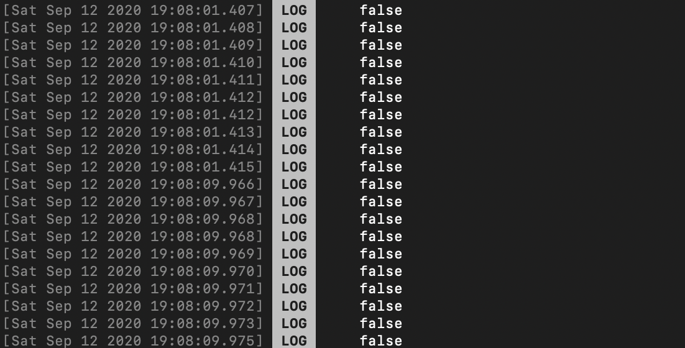

## useCallback && useMemo

새로 알게된 훅스인 useCallback에 대해 알아보겠다.

해당 훅스는 함수를 저장하는 훅스이다.

리액트는 임의의 컴포넌트 하나가 랜더링되면 랜더링 될 컴포넌트의 상위 컨텍스트를 리 랜더링 하기위해 재 실행 하게되는데, 함수형 컴포넌트는 `상위 컨텍스트가 바로 컴포넌트가` 되어버린다.

그로인해서 `TextInput`같은경우 본인이 만든 함수에 로그를 찍어보면 다음과 같이 미친듯한 호출을 보게된다.

밑에 나오는 로그처럼 해당 함수가 false 처리 하나만 하는 함수이면 성능에 문제가 없겠지만, 한 함수가 10초이상 걸리는 함수라면 ?

> 앱 성능은 보장 못한다.

이를 막고자 나온게 useCallback, useMemo이다.

둘 다 메모이제이션을 사용. 차이점이라면 useCallback 은 함수 자체를 저장, useMemo는 함수의 리턴값을 저장한다는거에 차이점을 두고있다.

### useMemo를 자세히 보자.

useMemo의 형태는 다음 아래와 같다.

첫 번째로는 메모이제이션 시킬 함수 즉 두 번째 인자가 변했을 때 실행시키고 싶은 함수.

두 번째 인자로는 노티시키고 싶은 변수 (해당 변수가 변하면 첫 번째 인자로 들어간 함수가 재 실행된다.)

### useCallback
