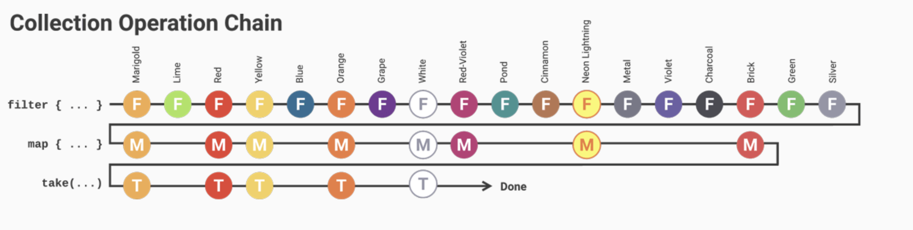
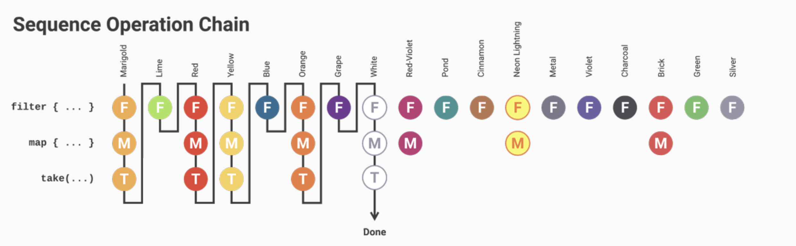

### 불변 리스트 ?

코틀린에서 리스트에다 원소를 추가할 시 새로운 리스트를 만들어낸다. 불변리스트로 데이터를 공유하는 방법을 사용해야한다.

### 로컬함수.

어떤 a 라는 함수가 b 라는 함수 내에서만 사용하는 경우에는 로컬 함수로 사용하는게 훨씬 낫다.

### 시퀀스 ?

컬렉션의 작업이 많을수록 즉, 컬렉션의 체인이 많을수록 시퀀스를 사용하는 편이 좋음.

ex )

```kotlin
listOf(1,2,3,4)asSequence().map { it * 2 }.filter { it == 2 }
```

## 컬렉션 사용.



## 시퀀스 사용.



## 변성.

- 공변성
- 반공변성
- 무공변성

### 공변성

Red가 Color의 하위 타입일 때 Matcher<Red> 가 Matcher<Color>의 하위타입일 때 Matcher<T> 는 타입 파라미터 T 에 공변성.

### 반공변성.

반대로 Red가 Color의 하위타입이고 Matcher<Color> 가 Matcher<Red> 의 하위타입일 때 Matcher<T>는 타입 파라미터 T에 반공변성.
